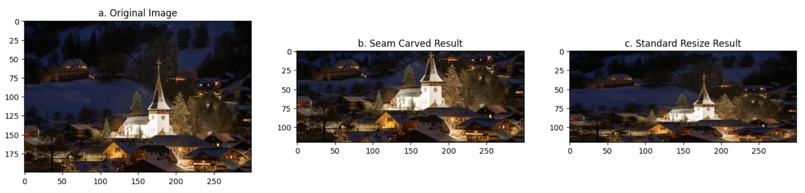

# Seam Carving for Content-Aware Image Resizing

This project is a Python implementation of the seam carving algorithm, a technique for content-aware image resizing. Instead of uniformly scaling an image, this method intelligently finds and removes the least "interesting" paths of pixels, known as seams, to reduce the image's dimensions while preserving important features.

## Demo

*(A sample output plotted alongside the original and the traditionally resized output.)*

---

## How It Works

The algorithm operates in a series of steps to intelligently resize an image:

1.  **Energy Calculation**: An "energy map" of the image is generated. Each pixel is assigned an energy value based on its contrast with neighboring pixels, typically calculated using image gradients. High-energy pixels represent edges and details, while low-energy pixels represent smooth areas.
2.  **Cumulative Energy Map**: Using dynamic programming, a cumulative minimum energy map is computed. Each cell in this map stores the total minimum energy of a connected path (a seam) from the first row/column to that specific pixel.
3.  **Seam Identification**: The optimal seam is identified by finding the pixel with the lowest cumulative energy in the last row (for vertical seams) or column (for horizontal seams) and then backtracking to find the lowest-energy path to the top/start.
4.  **Seam Removal**: The pixels along this optimal seam are removed, effectively reducing the image's width or height by one pixel.
5.  **Iteration**: The process is repeated until the desired dimensions are reached.

---

## Features

* **Energy Map Generation**: Calculates pixel energy using both simple gradients and a more robust Sobel operator.
* **Vertical & Horizontal Seam Carving**: Capable of reducing both the width and height of an image.
* **Seam Visualization**: Includes functionality to display the identified optimal seam overlaid on the image.
* **Comparative Analysis**: The script demonstrates resizing on various images and compares the seam-carved result against standard `cv2.resize`.

---

## Usage

To run this project on your own images, follow these steps:

1.  **Place Your Images**: Make sure your input image files (e.g., `photo.jpg`) are located in the **same directory** as the Python script.

2.  **Edit the Script**: Open the `.py` file in a text editor. Navigate to the final section of the script labeled `## 6. Testing With Different Images`. You will find blocks of code for processing each image. To change the input and the amount to resize, modify the parameters at the top of a code block:

    ```python
    # === Parameters to Tune ===
    image_filename = 'my_image_1.jpg'  # <-- Change this to your image file's name
    num_seams = 50                     # <-- Change this to how many pixels to remove
    direction = 'VERTICAL'             # <-- Set to 'VERTICAL' for width or 'HORIZONTAL' for height
    # ==========================
    ```

3.  **Run the Script**: Execute the script from your terminal:
    ```bash
    python seam-carving.py
    ```
The script will process the images as defined and save the resized outputs to the same directory.

---

## Dependencies & Installation

This project requires Python 3 and the following libraries:

* **OpenCV**: For image processing tasks (`cv2`).
* **NumPy**: For numerical operations and array manipulation.
* **Matplotlib**: For displaying images and plots.

You can install the necessary packages using pip:

```bash
pip install opencv-python numpy matplotlib
